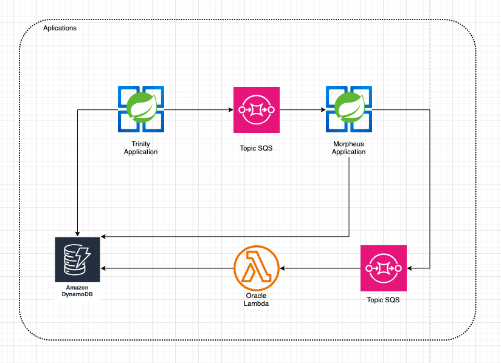

# 💠 Trinity

**Trinity** is a cloud-native application built to **register selected people** into a **DynamoDB** table and publish their data to an **AWS SQS** topic. It also provides an API to **query records by ID**, enabling asynchronous integrations with other parts of the system.

---

<p align="center">
  
</p>

## 🚀 Technologies Used

- **Spring Boot** `3.4.4`
- **Java 17 (GraalVM native image)**
- **AWS DynamoDB**
- **AWS SQS**
- **Docker + GraalVM**
- **Clean Architecture + SOLID Principles**

---

## 🧩 Project Structure

The application follows a modular and clean architecture, with a clear separation of responsibilities:

- `domain` — business logic and core entities
- `framework` — integrations with AWS services and infrastructure
- `messaging` — SQS communication logic

This design ensures high cohesion, low coupling, and strong adherence to **SOLID** principles.

---

## 📦 Features

### ✅ Create Person

```http
POST /person
```

### ✅ Find Person

```http
GET /person/{id}
```